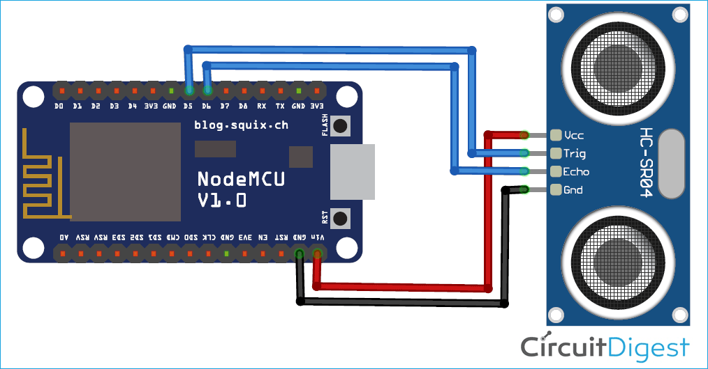

# Water Tank Level Monitor

This project monitors water tank levels using an ultrasonic sensor and publishes the data via MQTT. It's designed to run on an ESP8266-based board. Tested on NodeMCU V3 (LoLin).

## Prerequisites

- PlatformIO IDE or CLI
- ESP8266-based board (tested on NodeMCU v3)
- HC-SR04 ultrasonic sensor
- LED (built-in or external)

## Configuration

Before building the project, you need to set up your configuration:

1. Copy the configuration template:
   ```bash
   cp include/config.h.template include/config.h
   ```

2. Edit `include/config.h` and update the following values:
   ```cpp
   // WiFi credentials
   const char* WIFI_SSID = "your_wifi_ssid";
   const char* WIFI_PASSWORD = "your_wifi_password";

   // MQTT configuration
   const char* MQTT_SERVER = "your_mqtt_server_ip";
   const int   MQTT_PORT = 1883;
   const char* MQTT_TOPIC = "my/topic";
   ```

## Hardware Setup


<sub><sup>From https://circuitdigest.com/microcontroller-projects/iot-based-smart-jar-using-nodemcu-esp8266-and-ultrasonic-sensor<sup>

### Components
- ESP8266 board (NodeMCU v3) -> https://sklep.msalamon.pl/produkt/esp8266-nodemcu-v3-ch340
- HC-SR04 ultrasonic sensor
- LED (optional, for status indication)

### Connections
1. Ultrasonic Sensor (HC-SR04):
   - VU → 5V
   - GND → GND
   - TRIG → GPIO12 (D6) (or any other digital pin)
   - ECHO → GPIO13 (D7) (or any other digital pin)

2. LED (if using external):
   - Anode → GPIO2 (D4) with 220Ω resistor
   - Cathode → GND

## Functionality

The system works as follows:

1. **Initialization**:
   - Connects to WiFi using provided credentials
   - Establishes MQTT connection
   - Initializes ultrasonic sensor

2. **Measurement**:
   - Every 5 seconds, measures the distance to water surface
   - Applies median filtering to reduce noise
   - Calculates water level percentage
   - Publishes data to MQTT topic config.MQTT_TOPIC

3. **Status Indication**:
   - LED blinks during WiFi connection
   - LED indicates MQTT connection status
   - Serial output provides detailed status information

## MQTT Messages

The system publishes water level data as percentage values (0-100) to the topic config.MQTT_TOPIC.

Example message:
```
37  // 37% water level
```

## Serial Output

The system provides detailed logging via Serial:
```
----------------------------------------
System initialized
----------------------------------------
[123ms] WiFi: Connected (IP: 192.168.1.100)
[234ms] MQTT: Connected
[5000ms] Water Level: 37%
```

## Building and Uploading in PlatformIO

1. Open as new project, as the board by default is set to nodemcuv2 but can be changed to any other compatible board.

## Troubleshooting

1. **No MQTT Connection**:
   - Verify MQTT server address and port, use IP without http://
   - Verify port for SSL or NON-SSL version.
   - Check if MQTT server is running
   - Check serial output for connection errors

## License

This project is open source and available under the MIT License. 